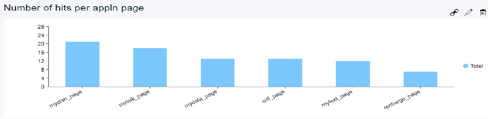

# IBM Ready App for Telecommunications

### Overview

IBM Ready App for Telecommunications demonstrates a new genre of mobile service provider where plans are controlled by the end user and not limited to a few choices. These dynamic service providers are starting to emerge all around the world. The app empowers the customer to control their mobile voice, text, and data plan while empowering the service provider to provide the right offers at the right time.
Please visit this [blog](https://developer.ibm.com/code/open/projects/ibm-ready-app-for-telecommunications/) for details on the business case.

### Setup Instructions

1. HotSpot feature: 
	The app retrieves hotspot entries from a Cloudant db and shows in the map. For this feature to work, please do the following setup.
	- Create a database by name 'telco' in a Cloudant service instance.
	- Upload JSON documents given in the file CloudantGeoAdapter/hotspots.json into 'telco' db
	- Create the following design document (index)

		{
	  	"_id": "_design/geodd",
	  	"_rev": "1-951ce177f5894819fa5a70da5f7e7920",
	  	"st_indexes": {
	    "geoidx": {
	      "index": "function(doc) {if (doc.geometry && doc.geometry.coordinates) {st_index(doc.geometry);}}"
	    			}
	  			}
		}

2. Download the adapters - UserLoginAdapter, TelcoUserAdapter and CloudantGeoAdapter.
3. In adapter.xml of CloudantGeoAdapter configure the Cloudant service details like account name and credentials.
4. Build the adapters and deploy to server. For more details on building adapter please refer to this [link](https://mobilefirstplatform.ibmcloud.com/tutorials/ru/foundation/8.0/adapters/creating-adapters/#build-and-deploy-adapters)

5. Register the application TelcoReadyAppAndroid in Mobilefirst admin console using the following details

	Application Name : TelcoReadyAppAndroid	

	Package : com.ibm.mil.readyapps.telco

	version : 1.0

6. Download the application TelcoReadyAppAndroid and import in Android Studio. Edit the mfpclient.properties and update wlServerHost and wlServerPort values to point to the MFP server

7. For the hotspot functionality to work,
	
	- Get an API key by following the steps [here](https://developers.google.com/maps/documentation/javascript/get-api-key) and update the same in the AndroidManifest.xml
	
8.  For the Twitter share funtionality to work,
	- Get Twitter Customer key and Customer secret by registering the app [here](https://apps.twitter.com/app/new)
	- Encode (base64) the key and secret and update the same in AndroidManifest.xml
	
9.  Build and run the app on emulator or actual device.

10.  On the login screen, please enter the username and password same for example john/john for the authentication to work.
11.  The app shows up the base plan and the additional packs that are available as add-on.
 
12.  As the add-ons are selected by the user, the base plan is updated and the same information is sent to the backend (dummy backend in this case) by the TelcoUserAdaper.
13.  CloudantGeoAdapter fetches the hotspot details from Cloudant DB and displays on the map.

14.  Analytics data is captured throughout the app. So, if analytics service is configured for the MFP server, custom charts can be drawn to showcase the customer usage patterns. For example, the mobile analytics custom chart below shows the number of hits on the different application pages

 
### Known Issues

1.	If you receive "Error:com.android.builder.internal.aapt.AaptException: Failed to crunch file" when building the app on android studio on windows, this might be because of the 240 character limitation. Please try moving the project up the project file path.

2. If the hotspot map is not showing check if GPS is 'ON', current location is marked in Google Maps, if the app permission request was accepted.

	

### License
IBM Ready App for Telecommunications is available under the IBM Ready Apps License Agreement. See the [License file](https://github.com/IBM-MIL/IBM-Ready-App-for-Telecommunications/blob/master/License.txt) for more details.
