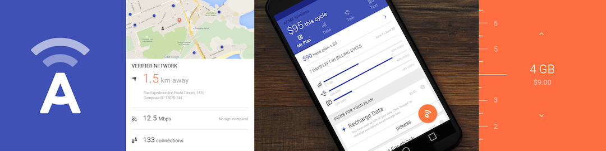

# IBM Ready App for Telecommunications

### Overview

IBM Ready App for Telecommunications demonstrates a new genre of mobile service provider where plans are controlled by the end user and not limited to a few choices. These dynamic service providers are starting to emerge all around the world. The app empowers the customer to control their mobile voice, text, and data plan while empowering the service provider to provide the right offers at the right time.

### Getting started
Please visit the [Getting Started page](http://lexdcy040194.ecloud.edst.ibm.com/telco_1_0_0/getting_started) to set up the project.

### Documentation
Please visit [this page](http://lexdcy040194.ecloud.edst.ibm.com/telco_1_0_0/home) for access to the full documentation.

### License
IBM Ready App for Telecommunications is available under the IBM Ready Apps License Agreement. See the [License file](https://github.com/IBM-MIL/IBM-Ready-App-for-Telecommunications/blob/master/License.txt) for more details.
